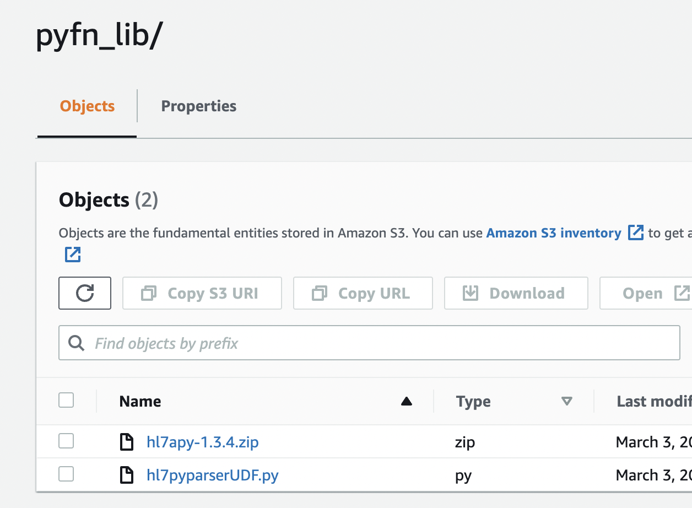
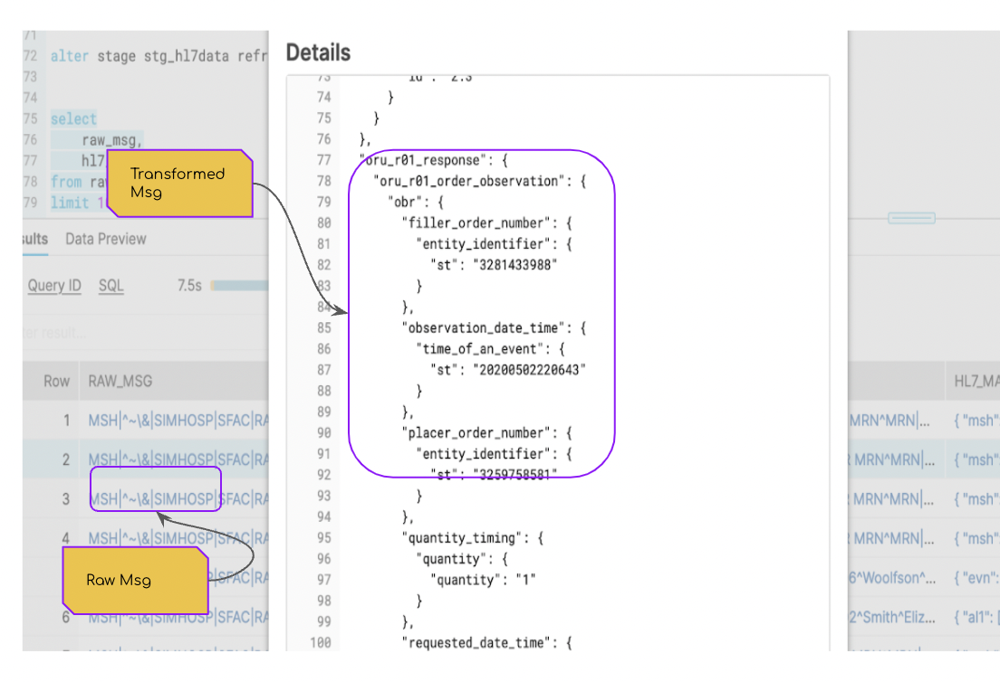

# hl7pyparser

Parsing HL7 message using PythonUDF.

This implementation uses the [HL7APY](https://github.com/crs4/hl7apy) python library, to parse the message into JSON format. 

## Solution Overview
- HL7 messages are stored in a table, with each row corresponding to a single HL7v2.x message.
- Invoke the UDF for each row, to get HL7v2.x message converted into a JSON format.

### Library
The [HL7APY](https://pypi.org/project/hl7apy/#files) v1.3.4 was used for this implementation.

## Installation 

### Deployment
* The [hl7pyparserUDF](../../src/main/python/hl7pyparserUDF.py) was staged in S3.
* The HL7APY-v1.3.4 was also staged in S3.
* The S3 bucket has been defined in Snowflake as an external stage (stg_hl7), with directory enabled.



### Registering the UDTF

The UDTF can be defined in Snowflake as below:
```sql
create or replace function hl7pyparser(hl7_raw string)
returns variant
language python
runtime_version = 3.8
imports=('@stg_hl7data/pyfn_lib/hl7apy-1.3.4.zip', '@stg_hl7data/pyfn_lib/hl7pyparserUDF.py')
handler = 'hl7pyparserUDF.udf'
comment = 'python based hl7v2 message parser'
;
``` 
## Sample run

### Parsing the HL7 data

The following query invokes the function, to parse the HL7 message file :

```sql
select
    raw_msg,
    hl7pyparser(raw_msg)
from raw
where message_type like 'ADT_A01'
limit 100
;
``` 
### Output



## Implementation

### Unziping the hl7apy
**Important**
We cannot import the hl7apy modules, asis. HL7apy library reads the local file system
during import of the module. The Snowflake PythonUDF, does not decompress the imported 
zip files at runtime, hence the HL7apy import statements will fail.

To overcome this, we extract the zip file into the /tmp folder and add the path to the
system paths.

Hence if the library name is changed, due to version upgrade, we should update the variable 'PACKAGE_ZIP'
in the source [hl7pyparserUDF](../../src/main/python/hl7pyparserUDF.py).
