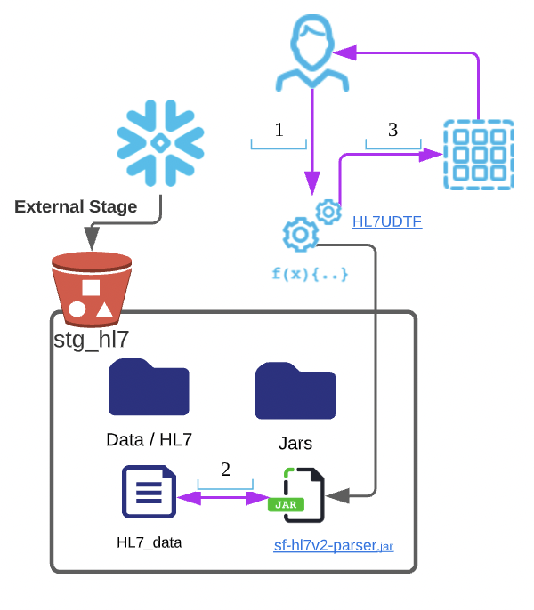
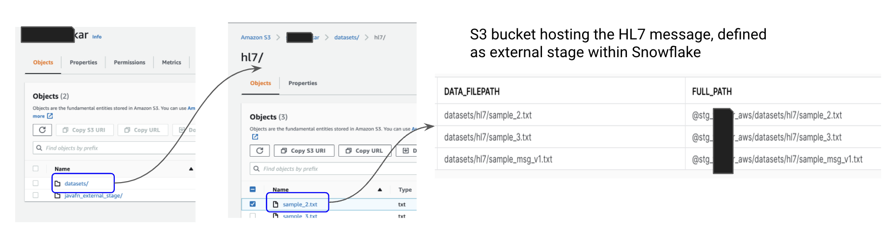
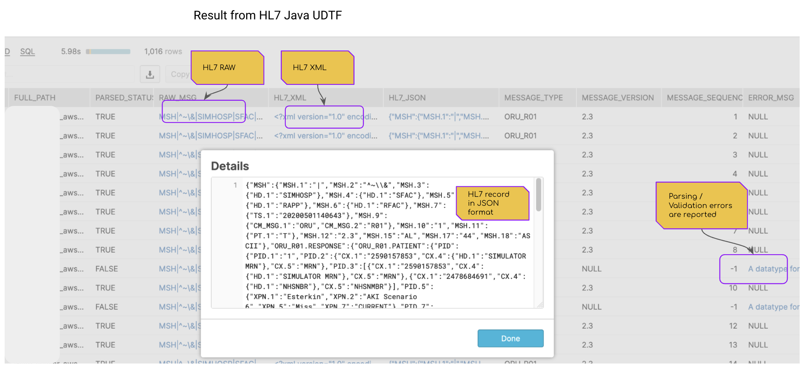
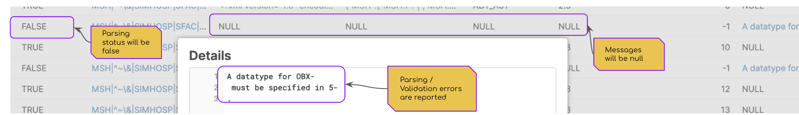

# HL7UDTF 

[HL7UDTF](../../src/main/java/com/snowflake/labs/hl7/HL7UDTF.java) is a java based UDTF, which uses 
the popular [HL7 HAPI parser](https://hapifhir.github.io/hapi-hl7v2/), to parse HL7 v2.3 messages. The messages are parsed as generic HL7 messages and the function returns :
- The raw message
- HL7 message in XML format
- HL7 message in JSON format
- certain message header fields like message version, message type and sequence number.
The output class is [HL7ParsedRecord](../../src/main/java/com/snowflake/labs/hl7/HL7ParsedRecord.java).

## Solution Overview
- HL7 message files are stored in an external stage.
- Each HL7 message files 
  - would contain only v2.3 messages. 
  - can contain one or more messages. 
  - The message can also be of different types (ex: ORU^R01 / ADT^A01).
  - HL7 message does start with MSH information.
- The java based function, is defined as a JavaUDTF.

### Steps


* 1 - User/Actor invokes the java fn, passing in the path to the HL7 data file.
* 2 - The java UDTF, parses the message file
* 3 - The java UDTF, returns 1 or more rows to the caller. Each row corresponds to 1 message found in the file.

## Installation 

### Building and Packaging the jar
Refer to [setup doc](../setup_java.md) section: Compiling and Packaging

### Deployment of jar
Refer to [setup doc](../setup_java.md) section: Staging the library

The below is a flow, if the jar was hosted in an external stage (S3)
* The Jar, sf-hl7v2-parser-1.0-SNAPSHOT-jar-with-dependencies.jar, is hosted in an S3 bucket. 
* The S3 bucket also hosts the directory, where the HL7 data files will reside.
* The S3 bucket has been defined in Snowflake as an external stage (stg_hl7), with directory enabled.

The sample datasets were hosted in a seperate folder.


### Registering the UDTF

The UDTF can be defined in Snowflake as below:
```sql
create or replace function hl7_hapi_parser(hl7_fl_url varchar ,validate_message boolean)
    RETURNS TABLE ( 
        parsed_status boolean, 
        raw_msg varchar, 
        hl7_xml varchar,  
        hl7_json variant,  
        message_type varchar, 
        message_version varchar, 
        message_sequence_num integer, 
        error_msg varchar 
    )
  language JAVA
  imports = ('@data_lib_stage/sf-hl7v2-parser-1.0-SNAPSHOT-jar-with-dependencies.jar')
  handler = 'com.snowflake.labs.hl7.HL7UDTF'
  comment = 'Java based UDTF for parsing HL7v2 files.'
;
``` 

## Sample run

### Parsing the HL7 data

The following query invokes the function, to parse the HL7 message file :

```sql
create or replace table raw_hl7 as
select * from (
with base as (
    select 
        relative_path as data_filepath,
        concat('@data_lib_stage/' ,data_filepath) as full_path
    from directory( @data_lib_stage )
    where relative_path like 'data/%'
)
select 
    full_path, p.* 
from base as b
    ,table(hl7_hapi_parser(b.full_path, false) ) as p
 
);
``` 
### Output

The result is as below :


### Sample post processing
The following is an example of how the json message can be parsed post parsing :

```sql
-- List out patient and physician interactions
with base as (
    select hl7_json 
    from raw_hl7
    where message_type = 'ORU_R01'
)
,patient_physician as (
    select 
        concat(
            f.value:"ORU_R01.PATIENT":"ORU_R01.VISIT":"PV1":"PV1.7":"XCN.2"::string, ' '
            ,f.value:"ORU_R01.PATIENT":"ORU_R01.VISIT":"PV1":"PV1.7":"XCN.3"::string) as physician
        ,concat(
            f.value:"ORU_R01.PATIENT":"PID":"PID.5":"XPN.1"::string, ' '
            ,f.value:"ORU_R01.PATIENT":"PID":"PID.5":"XPN.2"::string, ' '
            ,f.value:"ORU_R01.PATIENT":"PID":"PID.5":"XPN.3"::string, ' '
        ) as patient

    from base as b
        ,lateral flatten(input => hl7_json) as f
    where key like 'ORU_R01.RESPONSE'
    and patient is not null
)
select
    patient, physician
    ,count(*) as number_of_visits
from patient_physician
group by patient, physician
order by number_of_visits desc;
 ```

## Implementation

### Parameters
The UDTF takes the following parameter :
 - Location to the HL7 data file
 - To perform HL7 message conformance validation. 
   - True for validate
   - False for ignore validation 

### Errors
Any errors observed during parsing / validation are returned in the output column 'error_msg'. Errors could happen if the message structure was invalid or wrong version etc.. Errors could also be returned, if the validation flag was set to True. The XML & JSON will be null in case of errors. The parsing status will be set to False.



## Reasonings

#### Why isn't the message decomposition handled within Java? 
I realize that not all data team will have a Java developer. Instead of typical approaches of embedding logic within the java classes for validations, segmentations etc.. I adopted to returning the JSON format of the message. Since Snowflake works very well with JSON, this approach allows the Snowflake SQL/Snowpark developers to perform all post processing within Snowflake. 
